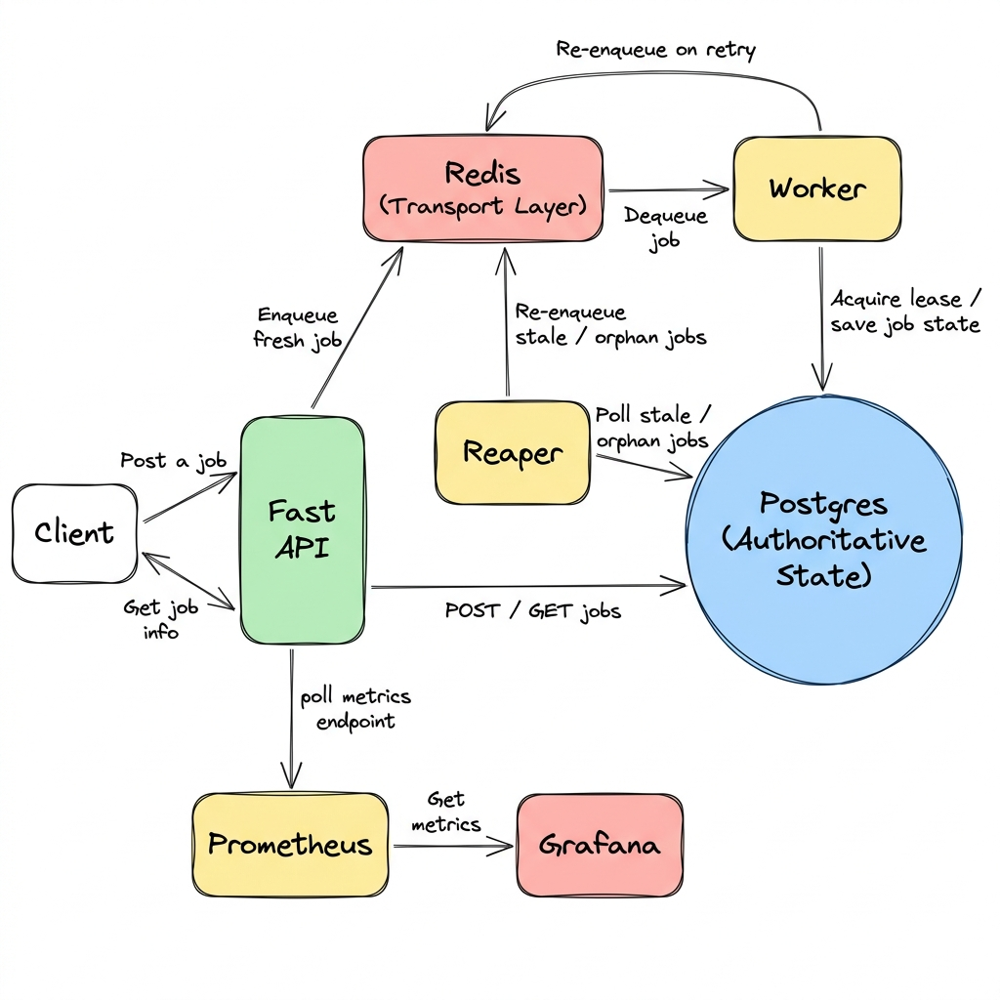
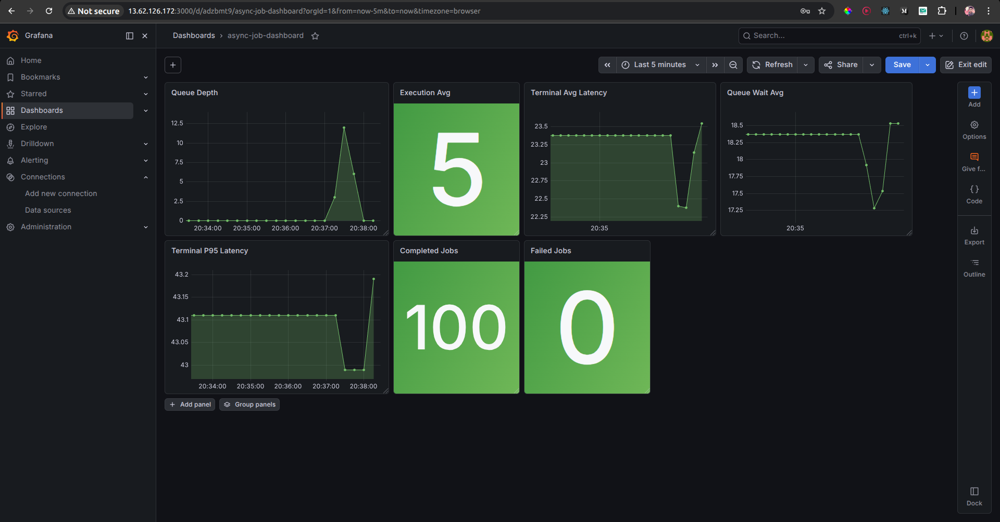

# Async Job Processing System

A lease-based asynchronous job execution system built with FastAPI, Redis, PostgreSQL, Prometheus, and Grafana.

The system is designed to execute background jobs under explicit ownership control, recover from worker failure safely, and expose operational behavior through latency decomposition and runtime metrics.

Repo layout is explicit:

- `backend/` contains the FastAPI service, workers, migrations, backend Dockerfile, and backend env files.
- `frontend/` contains the Vite-based visualizer UI.
- Repo root contains Docker Compose, CI/CD, and shared operational scripts.

---

## Problem

A distributed job system must solve four correctness problems:

- Prevent two workers from completing the same job
- Recover work if a worker dies mid-execution
- Distinguish execution failure from transport failure
- Observe queue pressure and latency under burst load

This project treats PostgreSQL as authoritative state and Redis only as transport.

---

## Architecture

```
Client
  ↓
API  ──────────────→  PostgreSQL (source of truth)
  ↓                        ↑
Redis (transport)      Reaper (recovery)
  ↓                        ↑
Worker ────────────────────┘
  ↓
Prometheus → Grafana
```

### System Diagram



| Flow                              | Description                                                           |
| --------------------------------- | --------------------------------------------------------------------- |
| Client → FastAPI                  | Submit jobs (`POST /jobs`) and poll status (`GET /jobs/{id}`)         |
| FastAPI → Redis                   | Enqueue fresh job id after DB commit                                  |
| FastAPI → Postgres                | Persist authoritative job state on every create/update                |
| Redis → Worker                    | Worker dequeues job id via blocking pop                               |
| Worker → Postgres                 | Acquire lease, save heartbeat, complete or fail job                   |
| Worker → Redis                    | Re-enqueue job id on declared failure (retry budget not exhausted)    |
| Reaper → Postgres                 | Poll for stale `processing` jobs beyond heartbeat timeout             |
| Reaper → Redis                    | Re-enqueue recovered job ids after clearing stale ownership           |
| FastAPI → Prometheus              | Expose `/metrics` endpoint scraped by Prometheus every 5s             |
| Prometheus → Grafana              | Grafana reads Prometheus as datasource for operational dashboards     |

### Components

| Component  | Role                                               |
| ---------- | -------------------------------------------------- |
| API        | Accepts jobs and writes authoritative state        |
| Redis      | Queue transport only                               |
| PostgreSQL | Source of truth for all lifecycle state            |
| Worker     | Claims and executes jobs under lease ownership     |
| Reaper     | Recovers stale work and reconciles queue transport |
| Prometheus | Metrics scraping                                   |
| Grafana    | Operational dashboards                             |

### Truth Hierarchy

Redis is not trusted for job truth. All lifecycle decisions are derived from PostgreSQL state.

---

## Job Lifecycle

```
queued → processing → done
queued → processing → failed
queued → processing → queued     (retry — worker re-enqueues)
queued → processing → queued     (reaper recovery)
API enqueue failure  → enqueue_failed
```

**Terminal states:** `done`, `failed`

`enqueue_failed` means the job row is durable in PostgreSQL but the Redis transport signal was never sent. The reaper reconciles these on its next poll cycle.

Terminal states are outside queue authority. Workers and reaper never mutate terminal jobs.

---

## Lease Ownership Model

A worker acquires authority by atomically updating:

```
status       = processing
owned_by     = worker_id
lease_version += 1
```

A completion is accepted only when:

```
lease_version matches
owned_by matches
status = processing
```

This prevents stale workers from writing after authority transfer.

---

## Failure Recovery

### Worker-declared failure

Execution failure increments `retry_count += 1` and transitions:

```
processing → queued        (while retry_count < MAX_RETRIES)
processing → failed        (when retry_count == MAX_RETRIES)
```

### Reaper recovery

The reaper detects stale workers using `last_heartbeat_at`. If the heartbeat timestamp exceeds the stale threshold (15 seconds), the reaper resets the job:

```
processing → queued
lease_version += 1
ownership cleared
claimed_at cleared
```

If `retry_count` has reached `MAX_RETRIES` at the point of reaper recovery, the job is transitioned directly to `failed` instead of being re-queued.

### Queue reconciliation

If PostgreSQL says `status = queued` but the Redis transport signal is missing (e.g. after an `enqueue_failed`), the reaper re-injects the queue signal on startup via `recover_queued_jobs()`. This restores delivery without mutating DB state.

---

## Graceful Shutdown

Workers handle `SIGTERM` and `SIGINT` with the following behavior:

- Stop claiming new jobs
- Finish currently owned lease
- Exit cleanly

Idle workers exit within the dequeue timeout using bounded Redis blocking.

---

## Observability

### State metrics

| Metric               | Description                 |
| -------------------- | --------------------------- |
| `queue_depth`        | Current Redis queue backlog |
| `jobs_by_state`      | DB lifecycle distribution   |
| `retry_distribution` | Retry count histogram       |

### Latency metrics

| Metric                         | Description                         |
| ------------------------------ | ----------------------------------- |
| `avg_terminal_latency_seconds` | Average end-to-end job latency      |
| `p95_terminal_latency_seconds` | Tail latency                        |
| `queue_wait_avg_seconds`       | Average time spent waiting in queue |
| `execution_avg_seconds`        | Average worker execution time       |

### Counters

| Metric                 | Description                  |
| ---------------------- | ---------------------------- |
| `jobs_claimed_total`   | Total claim events           |
| `jobs_completed_total` | Total successful completions |
| `jobs_failed_total`    | Total terminal failures      |
| `jobs_retried_total`   | Total retry events           |

### Metric truth model

Database-backed gauges represent authoritative lifecycle truth. Prometheus counters represent process-local event streams.

---

## Burst Behavior

Under burst submission:

- Queue wait rises first
- Execution latency remains stable
- p95 grows due to queue saturation

This demonstrates worker concurrency as the throughput boundary.

---

## Deployment Topology

### Local

Docker Compose with embedded PostgreSQL and Redis.

### VPC mode

```
Public subnet   → API node
Private subnet  → PostgreSQL node (reachable only via private IP)
Application     → Redis remains application-local
```

PostgreSQL is intentionally not exposed publicly.

### Docker Compose strategy

| Compose file               | Purpose                                   |
| -------------------------- | ----------------------------------------- |
| `docker-compose.base.yml`  | Shared runtime: api, worker, reaper       |
| `docker-compose.local.yml` | Adds postgres, redis, prometheus, grafana |
| `docker-compose.vpc.yml`   | Externalizes PostgreSQL to private subnet |

---

## Health Model

| Endpoint  | Checks                                |
| --------- | ------------------------------------- |
| `/health` | Process liveness only                 |
| `/ready`  | PostgreSQL reachable, Redis reachable |

This separates process truth from traffic readiness.

---

## Current Production Gaps

Not yet implemented:

- Structured logs
- CI/CD deployment pipeline
- Autoscaling
- Redis HA

---

## Running

### Local

```bash
docker-compose -f docker-compose.base.yml -f docker-compose.local.yml up --build
```

Backend env file for this mode: `backend/.env.local`
Frontend env file for this mode: `frontend/.env`

### VPC mode

```bash
docker-compose -f docker-compose.base.yml -f docker-compose.vpc.yml up --build
```

Backend env file for this mode: `backend/.env.vpc`

### Minimum deployment configuration

Backend runtime file must define:

```env
DATABASE_URL=postgresql://admin:<strong-password>@postgres:5432/jobs
REDIS_HOST=redis
REDIS_PORT=6379
CORS_ALLOW_ORIGINS=https://frontend.example.com
```

Frontend deployment must define:

```env
VITE_API_BASE_URL=https://api.example.com
```

If the frontend is served from a different origin than the API, `VITE_API_BASE_URL`
must target the public API URL and `CORS_ALLOW_ORIGINS` must include the public
frontend origin exactly.

### Frontend

```bash
cd frontend
npm install
npm run dev
```

### Dashboards

| Service    | URL                   |
| ---------- | --------------------- |
| Grafana    | http://localhost:3000 |
| Prometheus | http://localhost:9090 |
| API        | http://localhost:8002 |



Grafana is provisioned from `grafana/provisioning/datasources/prometheus.yml`,
so Prometheus is available as a datasource immediately after startup.
